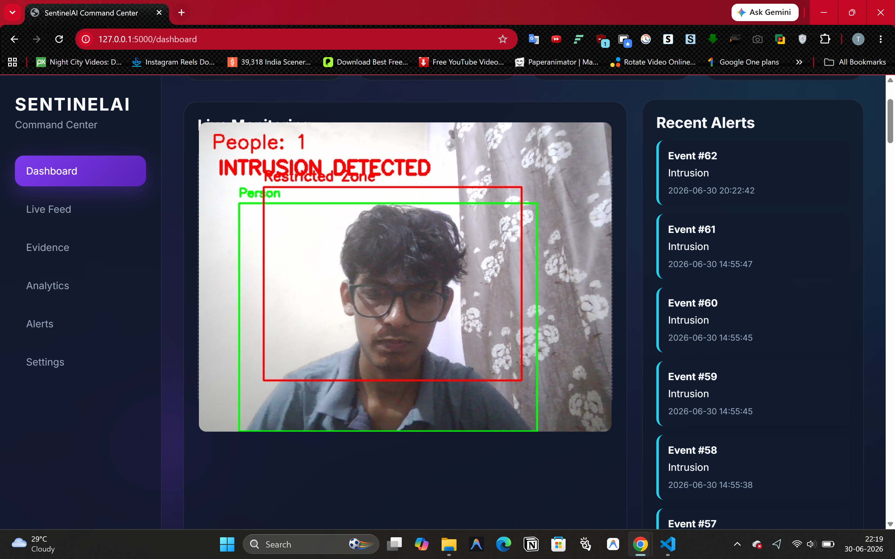
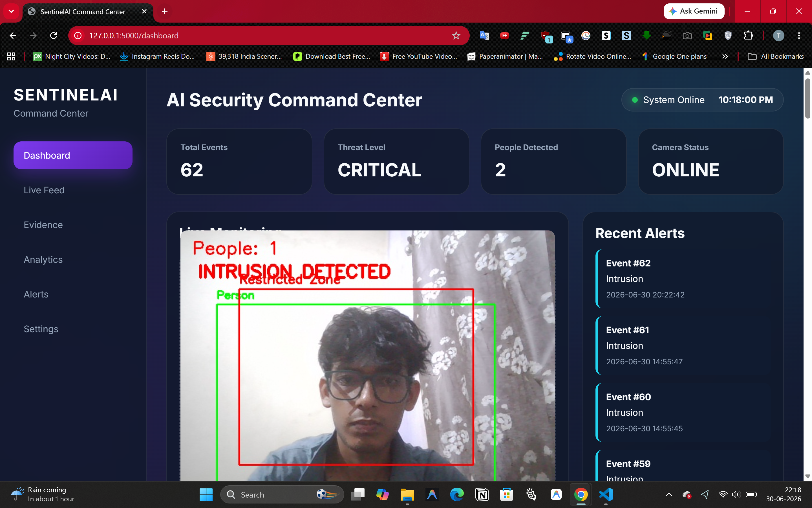
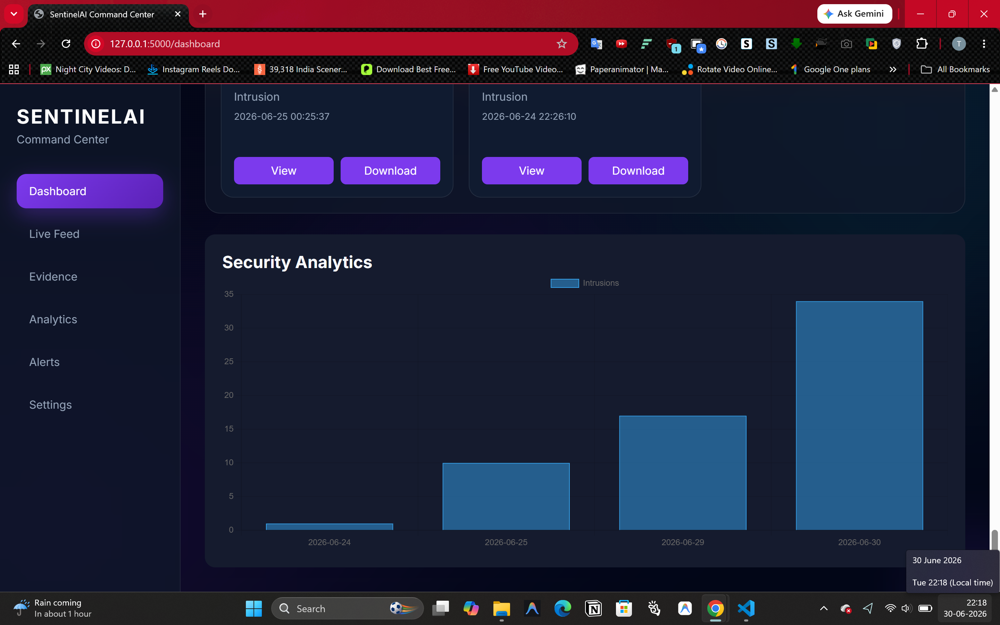
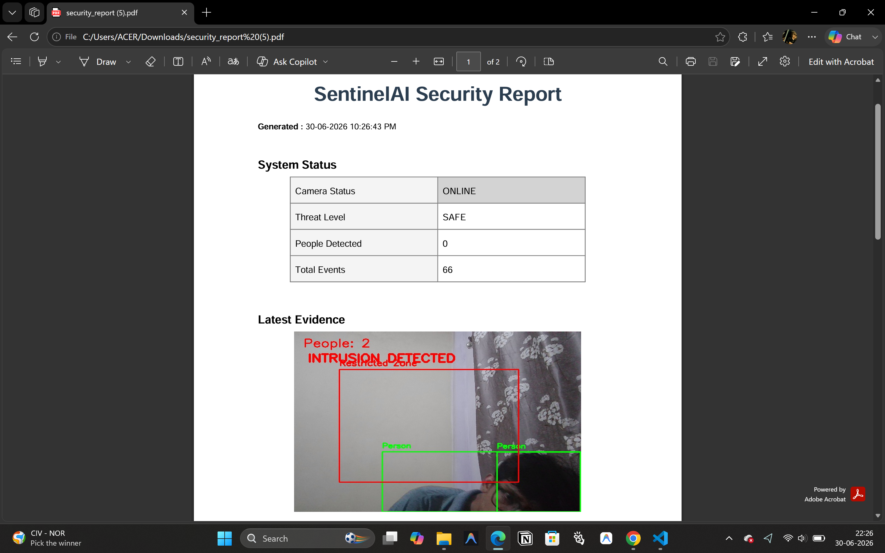
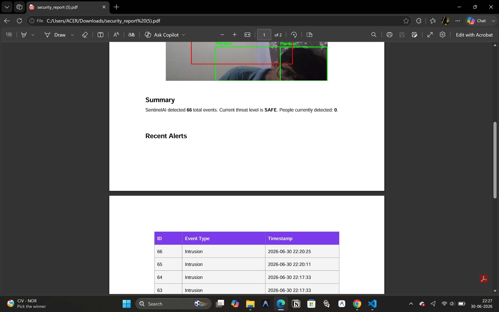
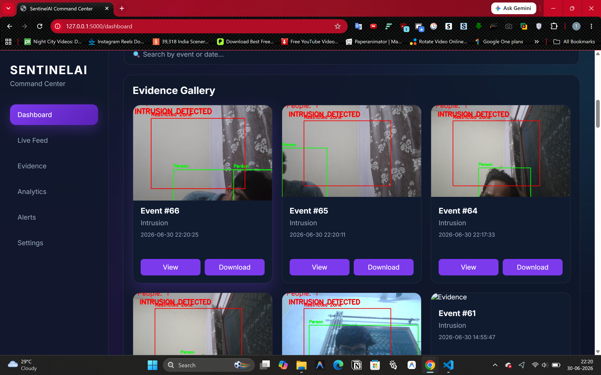

<div align="center">

# 🛡️ SentinelAI

### Enterprise-Grade AI Surveillance & Security Analytics Platform

Real-time, asynchronous surveillance system powered by **YOLOv8**, **ByteTrack**, **InsightFace**, and **Flask** for continuous intrusion detection, face recognition, real-time analytics, and automated reporting.

[](https://www.python.org/downloads/)
[](https://flask.palletsprojects.com/)
[](https://github.com/ultralytics/ultralytics)
[](https://opencv.org/)
[](https://sqlite.org/)
[](https://opensource.org/licenses/MIT)

<!-- Add your repository link to enable these dynamic badges -->
[](https://github.com/tanuj09-05/SentinelAI/stargazers)
[](https://github.com/tanuj09-05/SentinelAI/commits/main)

</div>

---

## 📖 The Problem & The Solution

Traditional surveillance systems are passive—they record data but require human intervention to detect threats. Existing AI solutions are often cloud-dependent, introducing latency, privacy risks, and high recurring costs.

**SentinelAI** is an intelligent, edge-capable, autonomous security system. By combining state-of-the-art computer vision models with a highly concurrent Flask backend, SentinelAI runs entirely on local hardware. It processes video streams, detects unauthorized intrusions, tracks movement trajectories, recognizes enrolled faces, and dispatches evidence-backed alerts—all in milliseconds, without blocking the live video feed.

---

## ✨ Features at a Glance

| Feature | Description | Status |
|---------|-------------|:------:|
| 🔐 **Role-Based Auth** | Secure, multi-user login and session management | ✅ |
| 👁️ **Asynchronous Video** | High-performance, concurrent live MJPEG video streaming | ✅ |
| 🎯 **YOLO Detection** | Millisecond-accurate human detection using YOLOv8 | ✅ |
| 🏃 **ByteTrack Tracking** | Persistent ID tracking for movement trajectory analysis | ✅ |
| 👤 **Face Recognition** | InsightFace integration (Cosine Similarity) for known/unknown subjects | ✅ |
| 🚨 **Spatial Threat Engine**| Coordinate-based boundary logic for restricted zone intrusion detection | ✅ |
| 📸 **Evidence Vault** | Automated snapshot captures of critical security events stored locally | ✅ |
| 📊 **Real-Time Analytics** | Interactive charts (Chart.js) and system metrics (CPU, RAM, FPS) | ✅ |
| 📧 **SMTP Alerts** | Asynchronous email dispatcher with attached photographic evidence | ✅ |
| 📄 **Automated Audits** | Programmatic PDF generation (ReportLab) for daily/weekly security reports | ✅ |
| ⚙️ **Dynamic Config** | Hot-swappable application configurations (SMTP, zones, AI toggles) | ✅ |
| 🎥 **Multi-Camera Ready**| Backend architectural support for simultaneous camera feeds | 🚧 |

---

## 📸 System Previews

### 1. Live AI Inference & Threat Detection
Real-time object tracking overlaid with security boundaries, ByteTrack IDs, and InsightFace recognition tags.
<p align="center">
  
</p>

### 2. Comprehensive Security Dashboard
Monitor active threats, track unique visitors, and analyze long-term security trends with interactive visualizations.
<p align="center">
  
  
</p>

### 3. Automated PDF Reporting & Evidence Logs
Instant, downloadable security audits and a dedicated gallery for reviewing physical intrusion snapshots.
<p align="center">
  
  
  
</p>

---

## 🏗️ Concurrency & Architecture

SentinelAI is built for performance. To ensure the UI remains highly responsive during intensive AI inference, the architecture heavily utilizes **ThreadPoolExecutors** and **Generator-based MJPEG streaming**. AI inference and database I/O never block the main web thread.

```mermaid
graph TD
    subgraph Frontend [Client Browser]
        UI[Live Dashboard] -->|HTTP GET /video_feed| Server
    end
    
    subgraph Backend [Flask Application]
        Server[Main WSGI Thread]
        Pool[ThreadPoolExecutor]
        
        Server -.->|Spawns| Pool
        
        subgraph Camera Worker [Background Camera Thread]
            Cam[OpenCV VideoCapture] --> Frame(Raw Frame)
            Frame --> AI[Detector Core]
            
            AI --> Y[YOLOv8]
            Y --> B[ByteTrack]
            B --> I[InsightFace]
            
            I --> Threat{Event Engine}
        end
        
        Pool --> Camera Worker
    end
    
    subgraph I/O [Asynchronous I/O]
        Threat -->|Intrusion| DB[(SQLite Database)]
        Threat -->|Snapshot| FS[Local Filesystem]
        Threat -->|Alert| SMTP[Email Dispatcher Thread]
    end
```

<details>
<summary>📂 <b>View Complete Project Structure</b></summary>

```text
SentinelAI/
├── app.py                   # Main Flask WSGI application and API route registry
├── config.py                # Global environmental constants and DB paths
├── core/                    # Core AI, Concurrency, and System Logic
│   ├── alert_manager.py     # Handles evidence snapshot generation and disk I/O
│   ├── analytics.py         # Advanced statistical computations for the dashboard
│   ├── camera_manager.py    # Multi-threaded camera streaming manager (Singleton)
│   ├── detector.py          # YOLO and ByteTrack inference abstraction layer
│   ├── email_alert.py       # Asynchronous SMTP alert dispatcher
│   ├── event_engine.py      # Spatial boundary calculations (Point-in-Polygon)
│   └── face_manager.py      # InsightFace embeddings & cosine similarity matching
├── database/                # Database configurations and schemas
│   ├── database.py          # SQLite connection pooling and initialization
│   └── user.py              # User authentication and settings logic
├── routes/                  # Flask Blueprint Route Handlers
│   ├── auth.py              # Login/Signup/Logout lifecycle
│   ├── faces.py             # Face enrollment and dataset management
│   ├── report.py            # PDF generation endpoints
│   └── settings.py          # User configurations (SMTP, zones)
├── models/                  # Local AI Weights (YOLOv8n.pt)
├── reports/                 # Auto-generated PDF output directory
├── static/                  # CSS, JavaScript, and UI Assets
├── templates/               # Jinja2 HTML Templates
├── assets/                  # Documentation images and screenshots
└── requirements.txt         # Pip dependency manifest
```
</details>

---

## 🚀 Installation & Deployment

### Prerequisites
- Python 3.10+ (64-bit recommended)
- C++ Build Tools (Required on Windows for compiling InsightFace dependencies)
- A compatible webcam or IP Camera stream

### 1. Clone the Repository
```bash
git clone https://github.com/tanuj09-05/SentinelAI.git
cd SentinelAI
```

### 2. Environment Setup
```bash
python -m venv venv

# Windows
venv\Scripts\activate
# Linux/macOS
source venv/bin/activate
```

### 3. Install Dependencies
```bash
pip install --upgrade pip
pip install -r requirements.txt
```
> **Note:** Upon first execution, SentinelAI will automatically download the required YOLOv8 (`yolov8n.pt`) and InsightFace (`buffalo_l`) model weights.

### 4. Configure Environment Variables
Copy the `.env.example` file to `.env` and configure your SMTP settings to enable email alerts:
```env
SECRET_KEY=your_secure_random_string_here
SENTINEL_SMTP_HOST=smtp.gmail.com
SENTINEL_SMTP_PORT=587
SENTINEL_SMTP_USERNAME=your_email@gmail.com
# Use an App Password if using Gmail/M365
SENTINEL_SMTP_PASSWORD=your_app_password 
```

### 5. Launch the Server
```bash
python app.py
```
Access the dashboard at `http://127.0.0.1:5000`

---

## 🛠️ API Documentation

SentinelAI exposes several JSON endpoints for programmatic integration or headless operation:

- `GET /api/status` - Returns real-time threat level, people count, and camera health.
- `GET /api/system_metrics` - Returns server CPU, RAM usage, and internal service health.
- `GET /api/alerts?q={query}` - Returns a paginated list of recent security events.
- `GET /api/analytics` - Returns time-series data for chart rendering.

---

## 💡 Troubleshooting

- **InsightFace Install Fails (Windows):** Ensure you have installed the "Desktop development with C++" workload via the Visual Studio Build Tools.
- **Camera Not Found:** Update `CAMERA_INDEX` in `config.py` from `0` to `1` or provide a valid RTSP stream URL.
- **Email Alerts Not Sending:** If using Gmail, ensure you have generated an **App Password** (2FA required), as standard passwords will be blocked.

---

## 🗺️ Roadmap

- [x] Integrate ByteTrack for persistent ID tracking
- [x] Implement InsightFace for known-visitor recognition
- [x] Multi-user authentication & session management
- [x] Asynchronous background task processing for email alerts
- [ ] **Multi-Camera Support (Part 5):** Simultaneous ingestion of up to 4 video streams
- [ ] **RTSP Support:** Native integration with IP security cameras
- [ ] **Dockerization:** Containerized deployment for effortless scaling
- [ ] **Cloud Storage:** AWS S3 integration for infinite evidence backup

---

## ⚖️ Ethics & Privacy Disclaimer
This software is intended for educational and ethical security monitoring purposes. Users are responsible for complying with local laws regarding surveillance, facial recognition, and data privacy (e.g., GDPR, CCPA). Do not use this software to monitor individuals without informed consent where legally required.

---

## 🤝 Contributing

Contributions make the open-source community an amazing place to learn, inspire, and create. 
1. Fork the project
2. Create a Feature Branch (`git checkout -b feature/AmazingFeature`)
3. Commit your changes (`git commit -m 'Add some AmazingFeature'`)
4. Push to the Branch (`git push origin feature/AmazingFeature`)
5. Open a Pull Request

---

## 📜 License

Distributed under the MIT License. See `LICENSE` for more information.

---

<div align="center">
  
**Tanuj Bisht**
<br>
B.Tech Computer Science Engineering
<br>
[GitHub Profile](https://github.com/tanuj09-05)

<br><br>
⭐ **If you found SentinelAI helpful, please consider giving it a star on GitHub!** ⭐
</div>
